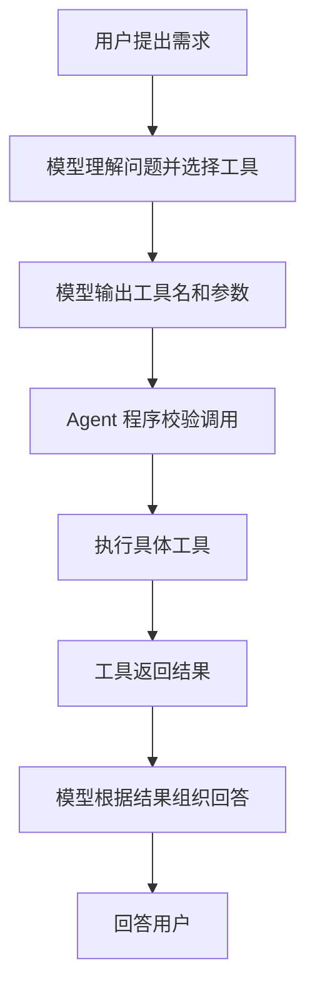

# Tool Calling：让大模型会“安排工具做事”

刚开始听到 Tool Calling，我以为是大模型自己去运行某个工具。现在我更愿意这样理解：**模型负责判断要用什么能力、准备什么参数；真正执行工作的，是 Agent 程序或工具服务。**

## 工具是什么？

工具是一个被清楚描述、可以通过参数调用的功能。它可以只是程序里的一个函数，也可以封装数据库查询、外部 API，或者作为独立服务提供。它不一定天然就是一个独立服务。

例如，一个查订单工具可以这样定义：

```text
名称：lookup_order
用途：查询订单物流状态
参数：order_id（订单号）
```

模型看到工具的名称、用途和参数说明后，可以判断当前问题是否需要它。如果需要，模型会生成结构化的调用请求，例如：

```json
{
  "name": "lookup_order",
  "arguments": {
    "order_id": "A20260918"
  }
}
```

这一步只是模型提出“请调用这个工具，并传入这些参数”，不代表查询已经发生。

## 一次 Tool Calling 的完整流程



例如：

```text
用户：A20260918 这个订单发货了吗？
模型：调用 lookup_order，参数 order_id=A20260918
程序：查询订单系统
工具：返回“已发货，顺丰运输中”
模型：您的订单已发货，正在由顺丰运输。
```

## Agent 程序为什么还要参与？

模型擅长理解自然语言、选择工具和组织参数，但不应该直接拥有任意执行程序的能力。Agent 程序负责检查工具是否存在、参数格式是否正确、用户是否有权限，然后才真正执行调用，并把结果交还模型。

因此，Tool Calling 的分工可以记成：

```text
模型：决定调用什么、参数是什么
Agent 程序：校验并调度调用
工具：执行具体工作并返回结果
```

查订单尤其需要权限检查。不能只要有人提供订单号，就直接返回订单或个人信息；实际系统还要验证当前用户是否有权查看。

## 一个工具可以串起多个步骤

用户说“帮我算一下这个订单的佣金”，系统可能需要：

```text
查订单工具：取得订单金额
        ↓
佣金计算工具：按业务规则计算
        ↓
模型：把结果解释给用户
```

佣金规则如果是固定的，应由程序按明确规则计算，而不是让模型心算。模型负责理解和调度，业务工具负责准确执行。

## Tool、Tool Calling、MCP 不是一回事

- **Tool**：具体能力，例如查订单、算佣金
- **Tool Calling**：模型提出结构化工具调用请求的机制
- **Agent 程序**：接收请求、校验并执行工具，再把结果返回模型
- **MCP**：一种标准化连接方式，可以让客户端发现并调用 MCP Server 暴露的工具

一个工具可以是本地函数，也可以连接远端服务；如果通过 MCP 提供，它也可以被不同的 MCP Client 按统一协议发现和调用。

另外，按步骤依次调用“查订单 → 算佣金”属于**多步流程**，不一定是多 Agent。只有多个不同职责的 Agent 互相协作时，才称为多 Agent。

## 我的总结

我现在把 Tool Calling 概括成一句话：

> **模型发出工具调用请求，程序负责安全、可靠地执行，工具返回结果后模型再回答用户。**

这让大模型不再只能生成文字，还可以借助程序连接数据和业务能力。刚刚完成的本地 Demo 用模拟订单查询和计算展示了这条链路：

[打开 Tool Calling Demo](http://127.0.0.1:8770/tool_calling_browser_demo.html)
