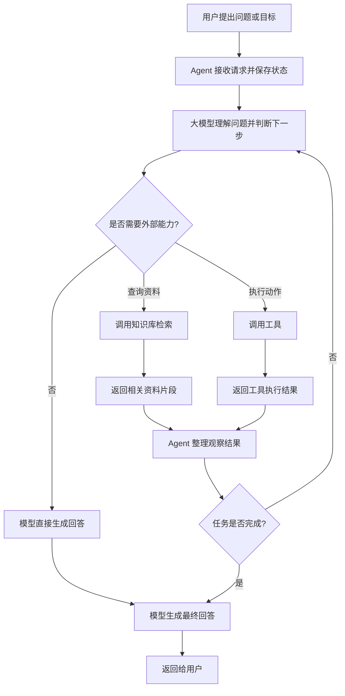

# 大模型、Agent、知识库与工具调用：它们是怎样协作的？

最近开始学习本地大模型之后，我逐渐理解了几个经常一起出现的概念：大模型、Agent、知识库和工具调用。

它们并不是同一个东西，而是像一个能够理解目标、查资料、使用工具并完成任务的智能助手。

## 一、先用一个比喻理解

可以把一个 Agent 系统想象成一个人：

| AI 系统部分 | 类比 | 主要职责 |
| --- | --- | --- |
| 大模型 | 大脑 | 理解问题、分析情况、做出判断、生成语言 |
| Agent | 神经系统和协调者 | 组织流程、保存状态、传递指令、决定下一步 |
| 知识库 | 记忆和专业书籍 | 提供垂直领域的资料和背景知识 |
| 工具 | 手脚和器械 | 真正执行查询、计算、读写文件等动作 |

这个比喻不是说 Agent 本身会思考，而是说它把模型的判断和外部能力连接起来。

## 二、普通聊天和 Agent 的区别

普通聊天通常是：

```text
用户提问 → 大模型回答
```

大模型主要依靠自身参数中的知识进行回答。

Agent 系统则更像一个办事流程：

```text
用户提出目标
    ↓
模型理解目标并判断下一步
    ↓
Agent 执行模型决定的动作
    ↓
工具或知识库返回结果
    ↓
Agent 把结果交回模型
    ↓
模型生成回答，或继续进行下一步
```

因此，Agent 的核心不是“多一个聊天窗口”，而是具备一种循环：

```text
理解目标 → 做出决定 → 执行动作 → 获取结果 → 继续完成任务
```

## 三、知识库是什么？

知识库通常保存企业资料、产品文档、售后政策、项目说明、个人笔记等内容。

在 RAG 系统中，原始文档会被切成较小的片段，再通过 Embedding 模型转换成向量，保存到索引或向量数据库中。当用户提问时，系统会检索语义相关的片段，再把这些资料交给大模型参考。

所以知识库更像是 Agent 的“外部记忆”，适合保存大模型原本不知道、或者需要依据最新资料回答的内容。

知识库本身不负责思考，也不直接生成最终答案。它主要负责回答：

```text
“和这个问题相关的资料在哪里？”
```

## 四、工具调用是什么？

工具是已经封装好的能力。例如：

- 查询当前时间
- 计算数学表达式
- 搜索本地知识库
- 查询订单状态
- 读取文件
- 调用数据库
- 发送邮件或创建日历事件

模型不会直接执行这些动作。模型会先输出一个结构化的调用请求，例如：

```json
{
  "name": "search_local_knowledge",
  "arguments": {
    "query": "Agent 和普通聊天机器人有什么区别？"
  }
}
```

Agent 读取这个请求，找到对应的 Python 函数并执行。工具返回结果后，Agent 再把结果交给模型，让模型生成自然语言回答。

可以简单总结为：

```text
模型负责想做什么
Agent 负责协调怎么做
工具负责真正做事
```

## 五、一个完整例子：查询订单的客服 Agent

用户说：

```text
我的订单为什么还没有发货？
```

系统可能这样工作：

1. 模型识别出这是订单查询问题。
2. Agent 发现当前缺少订单号。
3. Agent 请用户补充订单号。
4. 用户提供订单号。
5. 模型决定调用订单查询工具。
6. Agent 调用订单系统并传入订单号。
7. 订单工具返回发货状态。
8. Agent 把结果交给模型。
9. 模型生成清晰、礼貌的客服回复。

这个过程里，模型负责理解和判断，Agent 负责多轮协调，工具负责查询真实数据。

## 六、整体流程图



## 七、知识库和工具不是 Agent 的必需品

最简单的 Agent 可以只有：

```text
大模型 + Agent 运行循环
```

它可以让模型进行多步分析、检查自己的回答、根据中间结果决定是否继续。

知识库和工具是 Agent 的扩展能力：

- 知识库让 Agent 能够访问垂直领域资料。
- 工具让 Agent 能够访问外部世界并执行动作。

如果步骤永远固定，例如“分析 → 写作 → 检查 → 修改”，它更像一个工作流。如果模型可以根据情况动态决定下一步，才更接近 Agent。

## 八、我目前的本地实验

当前本地 Demo 使用 Ollama 运行 Qwen3-14B，并通过 Python Agent 连接模型、工具和 RAG 知识库：

```text
Qwen3-14B：负责理解问题和选择工具
Python Agent：负责协调流程和执行调用
bge-m3：负责把问题和资料转换成向量
本地知识库：提供 Agent 相关学习资料
工具：查时间、计算、列出资料、检索知识库
```

这个 Demo 的价值不在于功能复杂，而在于把 Agent 的底层链路完整展示出来：

```text
模型提出工具调用 → Agent 执行工具 → 工具返回结果 → 模型生成回答
```

## 结语

Agent 并不是一个神秘的独立模型，也不一定等于某个框架。它更像一套让大模型能够围绕目标持续判断、调用能力并完成任务的运行机制。

一句话总结：

```text
模型负责思考，Agent 负责协调，知识库负责提供资料，工具负责执行动作。
```

LangChain、LangGraph 等框架，主要是帮助开发者更方便地组织这些组件。但理解这条最底层的链路，比一开始直接学习框架更重要。
