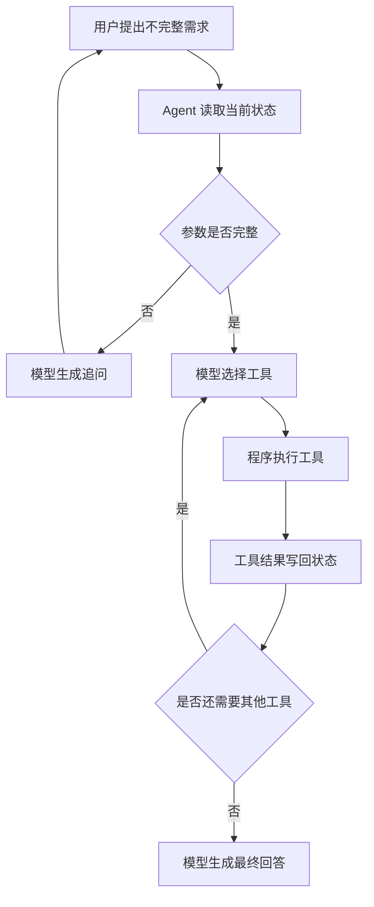

# 多轮 Agent：让大模型学会“把问题问完整”

最近学习 Agent 时，我逐渐理解了一个很重要的概念：**多轮 Agent 并不是单纯让用户和大模型多聊几句，而是让 Agent 通过连续对话，把一个不完整的自然语言需求，补全成可以执行的任务。**

## 一、为什么需要多轮 Agent

现实中的需求通常不是一次性完整的。

用户可能只会说：

> 我想去东京旅游。

但真正规划旅行，还需要知道：

- 从哪里出发
- 什么时候出发
- 计划玩几天
- 有多少预算
- 喜欢什么样的交通和住宿

如果这些信息都不知道，系统就很难调用航班、酒店或天气工具。

因此，Agent 需要先判断：**当前信息够不够执行任务？还缺什么？**

## 二、多轮 Agent 像函数调用前的参数补全

可以把工具想象成一个函数：

```python
def search_flight(origin, destination, date):
    ...
```

这个函数需要三个参数：

```text
origin       出发地
destination  目的地
date         出发日期
```

用户只说“我想去东京”，相当于只提供了：

```text
destination = 东京
origin = 缺失
date = 缺失
```

Agent 就会继续询问：

```text
请问您从哪里出发？准备什么时候去？
```

当用户补充完整后，Agent 才能组织成结构化参数：

```json
{
  "origin": "上海",
  "destination": "东京",
  "date": "2026-10-18"
}
```

然后调用工具：

```python
search_flight("上海", "东京", "2026-10-18")
```

所以，多轮 Agent 可以理解为：

> **使用自然语言完成函数调用之前的参数收集和上下文准备。**

## 三、多轮 Agent 的基本流程



这里有几个关键角色：

- **模型**：理解用户表达，判断缺少什么，以及下一步做什么
- **Agent 程序**：保存对话状态，控制循环并执行工具
- **工具**：真正查询数据或执行操作
- **状态**：记录已经收集到的参数和工具结果

模型不会直接访问航班系统或订单系统。模型只是提出工具调用请求，Agent 程序才是真正执行调用的一方。

## 四、旅行规划是一个典型例子

一次完整的旅行规划可能是这样的：

```text
用户：我想去东京旅游
Agent：什么时候出发？从哪里出发？
用户：10 月 18 日从上海出发
Agent：计划玩几天？预算是多少？
用户：玩 4 晚，总预算 12000 元
Agent：有什么住宿偏好吗？
用户：交通方便即可，每晚不超过 700 元
Agent：开始查询航班、天气和酒店
```

此时 Agent 已经收集到：

```text
目的地：东京
出发地：上海
日期：2026-10-18
住宿：4 晚
总预算：12000 元
住宿预算：每晚不超过 700 元
偏好：交通方便
```

接下来它可以调用多个工具：

```text
search_flights()  查询航班
get_weather()     查询天气
search_hotels()   查询酒店
```

最后，大模型读取工具结果，把分散的信息整理成一个完整的旅行方案。

## 五、售后和客服也是典型场景

多轮 Agent 并不只适合旅行规划，客服和售后其实更加常见。

例如用户说：

```text
我的设备坏了。
```

Agent 还不知道具体是什么设备、什么型号、什么故障，因此会继续询问：

```text
是什么产品？具体型号是什么？出现了什么故障？
```

用户补充后，Agent 可以进一步调用：

```text
查询订单工具
查询保修政策工具
查询故障知识库工具
创建维修单工具
```

完整流程可能是：

```text
识别产品
→ 收集型号
→ 收集故障现象
→ 查询订单
→ 判断是否在保修期
→ 给出解决方案
→ 创建维修单或转人工
```

客服是一个更大的范围，售后是客服中的具体业务。订单查询、物流查询、退换货、维修和退款，都可能需要多轮参数补全。

## 六、多轮 Agent 和普通表单有什么区别

传统 App 表单也在做参数收集：

```text
用户填写表单
→ 程序检查字段
→ 提示“出发地不能为空”
→ 用户继续填写
```

多轮 Agent 则把这个过程变成了自然语言对话：

```text
用户：我想去东京旅游
Agent：请问什么时候去？从哪里出发？
```

两者底层目标相同：

```text
收集参数
→ 校验参数
→ 参数完整
→ 调用业务能力
```

区别在于：

- **表单**：页面驱动参数补全，字段固定、规则明确
- **多轮 Agent**：对话驱动参数补全，表达更灵活

真实产品通常会混合使用两种方式。Agent 可以先通过对话理解需求，页面再用日期选择器、金额输入框等控件收集精确参数。

## 七、多轮 Agent 不只是“不断追问”

一个可靠的多轮 Agent 还需要处理很多工程问题：

- 参数格式是否正确
- 用户是否中途改变了目的地
- 工具调用是否失败
- 用户是否想取消任务
- 追问次数是否过多
- 是否需要转人工
- 是否应该保存用户偏好

因此，实际系统通常会设置：

```text
最大追问次数
参数格式校验
工具超时处理
用户取消机制
人工接管机制
```

多轮 Agent 的目标不是把对话变长，而是用尽量少的对话，把任务推进到可以执行的状态。

## 八、我的理解

现在回头看，多轮 Agent 可以用一句话概括：

> **它是一个通过自然语言补全任务参数和背景信息，再调用工具完成目标的 Agent。**

旅行规划、订单查询、售后维修、退款申请和预约服务，本质上都可以抽象成：

```text
用户目标
→ 缺失信息
→ 多轮追问
→ 结构化参数
→ 工具调用
→ 结果返回
→ 最终回答或后续动作
```

当前的旅行规划 Demo，展示的正是这条链路：模型负责理解和判断，Agent 负责保存状态和推进流程，工具负责完成具体查询。

这也让我更清楚地看到：Agent 并不是一个神秘的“自主生命体”，而是一套由模型、状态、工具和执行循环组成的任务系统。
