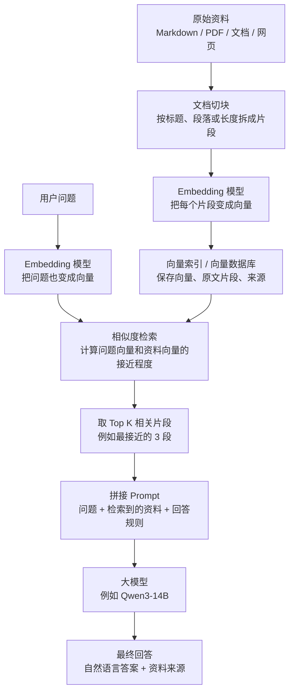
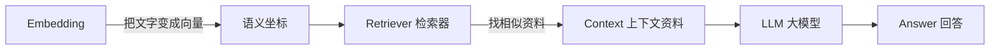
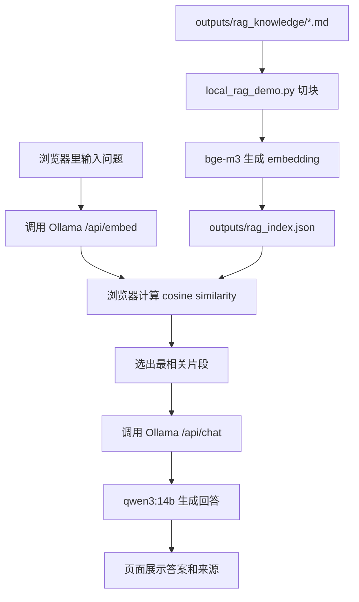

# RAG 操作流程与原理简明说明

## 一句话理解

RAG 是：先从你的资料库里找出和问题最相关的资料片段，再把这些片段交给大模型，让大模型基于资料回答。

它不是让大模型“记住”你的文档，而是在每次提问时临时检索资料，并把资料塞进这次对话上下文。

## 操作流程图



## 每一步在做什么

1. 准备资料

把你想让模型参考的资料放进知识库，比如产品文档、售后说明、会议纪要、公司制度、个人笔记。

2. 文档切块

长文档不能整篇直接塞给模型，所以要切成较小片段。切块的好坏会影响检索质量。

常见方式：

- 按 Markdown 标题切
- 按段落切
- 按固定字数切
- 切块之间保留一点重叠内容

3. 生成 Embedding

Embedding 模型把每个资料片段变成一串数字，也就是向量。

可以理解为：每段文字被放进一个高维语义地图里，有了自己的坐标。

4. 建立索引

系统保存三类东西：

- 资料片段的原文
- 资料片段的向量
- 资料片段的来源，比如文件名、标题、页码

小规模实验可以存在 JSON 文件里。资料多了以后，可以换成 Chroma、FAISS、Qdrant、Milvus 这类向量数据库。

5. 用户提问

用户的问题也会先经过同一个 Embedding 模型，变成一个问题向量。

6. 相似度检索

系统比较“问题向量”和“资料片段向量”的接近程度。

常见算法：

- Cosine similarity：看两个向量方向像不像
- Dot product：看两个向量的点积
- L2 distance：看两个点的距离

我们的本地 demo 使用的是 cosine similarity。

7. 取出相关资料

系统通常取分数最高的几个片段，比如 Top 3 或 Top 5。

这些片段不是最终答案，而是给大模型看的参考资料。

8. 拼接 Prompt

把用户问题和检索到的资料片段拼成一个提示词，例如：

```text
请只基于以下资料回答问题。
如果资料里没有答案，请说不知道。

资料：
...

问题：
...
```

9. 大模型回答

大模型读取这些资料片段，然后生成自然语言答案。

10. 展示来源

好的 RAG 系统会同时展示引用来源，让用户知道答案来自哪些文件或片段。

## 关键概念关系



## 和普通大模型问答的区别

普通问答：

```text
用户问题 -> 大模型 -> 回答
```

RAG 问答：

```text
用户问题 -> 检索资料 -> 把资料交给大模型 -> 基于资料回答 -> 展示来源
```

区别在于：RAG 在大模型回答前，多了一步“查资料”。

## 为什么 RAG 适合垂直场景

RAG 特别适合这些场景：

- 企业产品知识
- 售后客服
- 内部制度
- 项目文档
- 会议纪要
- 专业知识库
- 个人笔记

因为这些内容通常不是大模型通用知识里稳定、完整、最新的部分。

## 当前本地 Demo 的链路



## 最小 RAG 系统要做的事

1. 把文档切块
2. 调 Embedding 模型
3. 保存向量和来源
4. 用户提问时检索相似片段
5. 写 Prompt，把资料交给大模型
6. 展示答案和资料来源

## 一句话总结

Embedding 负责把文字放进语义地图，检索器负责找到离问题最近的资料，RAG 负责把资料拿给大模型看，大模型负责组织最终答案。
