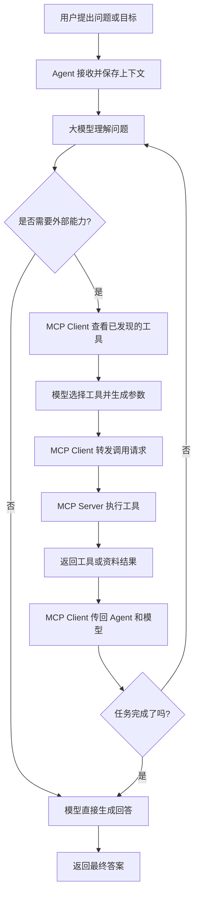
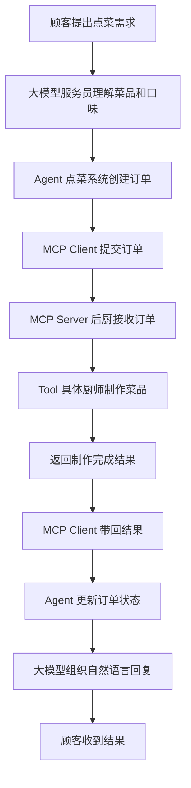
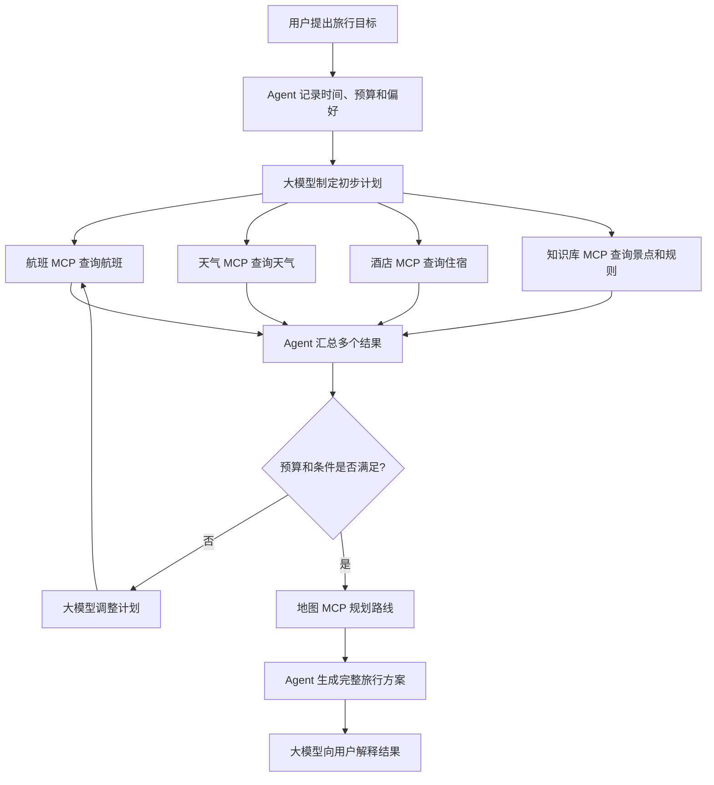

# MCP 是什么？让大模型学会使用外部能力

最近学习 Agent 的过程中，经常会遇到一个词：MCP。

MCP 的全称是 Model Context Protocol，中文可以理解为“模型上下文协议”。它不是一个大模型，也不是一个 Agent 框架，更不是某一个具体的工具。

MCP 更像是一套标准化的连接协议，用来让 AI 应用发现和调用外部的工具、资料和服务。

## 一、为什么需要 MCP？

在没有 MCP 的时候，如果一个 Agent 想调用外部能力，通常需要开发者单独写连接代码：

```text
想查物流 → 写物流 API 适配代码
想读文件 → 写文件系统代码
想操作浏览器 → 写浏览器连接代码
想调用 Figma → 再写一套 Figma 连接代码
```

每接入一个新系统，都需要重新了解它的接口、参数和返回格式。

MCP 想解决的问题是：

```text
外部能力按照统一标准暴露
AI 应用按照统一标准发现和调用
```

这样，一个工具只要提供 MCP 接口，就可以更容易地被不同的 AI 应用接入。

## 二、MCP 可以类比成什么？

MCP 可以类比成 AI 领域的“标准插口”或“统一通信协议”。

也可以用项目团队来理解：

| AI 系统角色 | 项目团队类比 | 主要职责 |
| --- | --- | --- |
| 用户 | 需求提出者 | 提出问题或目标 |
| 大模型 | 方案负责人 | 理解需求、分析情况、决定下一步 |
| Agent | 项目经理 | 保存状态、安排流程、推动任务完成 |
| MCP Client | 技术接口协调员 | 发现能力、转发请求、传回结果 |
| MCP Server | 外部服务团队 | 提供能力并执行请求 |
| Tool | 具体开发任务 | 查时间、查资料、读文件、查数据库 |

这个类比里，MCP Client 不太像产品经理。它更像负责对接外部系统的技术协调员。

## 三、MCP Server 是什么？

MCP Server 是一个提供能力的服务程序。

它会告诉外部 AI 应用：

```text
我是谁？
我有哪些能力？
每个能力叫什么？
每个能力需要什么参数？
调用后会返回什么？
```

例如一个本地学习 MCP Server 可以暴露：

```text
get_current_time
    功能：查询当前时间
    参数：timezone_name

search_local_knowledge
    功能：搜索本地知识库
    参数：query、top_k
```

MCP Server 不只是一本“工具说明书”。它同时包含真正执行工作的程序。

```text
工具描述 = 使用说明
工具代码 = 实际执行逻辑
MCP Server = 说明和执行服务的组合
```

例如 `search_local_knowledge` 工具内部可以执行：

```text
问题 → bge-m3 向量化
    → 和知识库向量比较
    → 找到相关片段
    → 返回资料和来源
```

因此，MCP Server 也可以连接知识库、数据库、文件系统、浏览器或企业内部系统。

## 四、MCP Client 是什么？

MCP Client 是 AI 应用中的连接器。

它连接 MCP Server 后，会先进行能力发现：

```text
Client：你是谁？
Client：你有哪些工具？
Client：每个工具需要什么参数？
Client：调用结果是什么格式？
```

MCP Server 返回工具清单后，Client 把这些工具说明交给 Agent 和大模型。

因此 MCP Client 主要负责：

- 建立连接
- 发现工具和资源
- 读取工具说明
- 把工具注册到 Agent 或模型上下文
- 转发模型的调用请求
- 把执行结果带回模型

它通常不会自己判断业务问题，也不会自己决定查哪个工具。

## 五、大模型是怎么知道该调用 MCP 工具的？

大模型并不是天生知道 MCP，也不是自动知道电脑里有哪些工具。

MCP Client 会先把工具名称、功能说明和参数格式告诉模型。

模型看到的可能是：

```text
工具：search_local_knowledge
说明：搜索本地 Agent 学习资料
参数：query、top_k
```

当用户提出问题：

```text
请根据本地资料解释 RAG
```

模型就会根据工具说明判断：

```text
这个问题需要查询本地知识库
```

然后输出结构化调用请求：

```json
{
  "name": "search_local_knowledge",
  "arguments": {
    "query": "RAG",
    "top_k": 3
  }
}
```

模型负责选择工具和填写参数，但不会直接执行工具。

## 六、完整调用流程



## 七、用项目管理来理解一次调用

用户说：

```text
请根据本地资料解释 Agent 和普通聊天机器人的区别。
```

系统可以这样工作：

1. 用户提出需求。
2. 大模型作为方案负责人，判断这是一个知识查询问题。
3. Agent 作为项目经理，决定推进一次资料查询任务。
4. MCP Client 作为技术协调员，找到 `search_local_knowledge` 工具。
5. MCP Client 把调用请求转给 MCP Server。
6. MCP Server 执行向量检索，查找本地资料。
7. MCP Server 返回资料片段和来源。
8. MCP Client 把结果传回 Agent 和大模型。
9. 大模型根据资料组织最终回答。

这里的分工是：

```text
大模型负责判断做什么
Agent 负责协调任务
MCP Client 负责连接和传递
MCP Server 负责提供能力和执行
知识库负责提供资料
```

## 八、MCP 和普通 API 的区别

普通 API 通常是某个服务定义的一组接口。

例如物流 API：

```text
POST /tracking
参数：物流公司、物流单号
返回：物流轨迹
```

MCP 不是替代所有 API，而是在 API 之上提供一套更适合 AI 应用使用的标准方式。

一个 MCP Tool 内部仍然可以调用普通 API：

```text
大模型
  ↓
MCP Client
  ↓
MCP Server
  ↓
物流 API
  ↓
物流供应商
```

MCP Server 可以把复杂的 API 参数、认证和返回格式封装起来，只向模型展示清晰的工具名称和参数。

## 九、用饭店点菜理解 MCP

如果觉得技术架构有些抽象，可以把 MCP 想象成饭店里的点菜和后厨系统。

用户来到饭店，对服务员说：

```text
我想点一份西红柿炒鸡蛋，不加糖。
```

各个角色可以这样对应：

```text
用户       = 顾客
大模型     = 服务员
Agent      = 整个点菜系统和订单状态系统
MCP Client  = 提交订单、连接后台的模块
MCP Server  = 后厨
Tool       = 负责具体炒菜的厨师或工作岗位
知识库     = 菜谱、食材说明和制作规则
```

### 1. 大模型像服务员

服务员负责理解顾客的话，确认菜品、数量和口味，然后把需求记录下来。

在 AI 系统中，大模型负责理解用户的自然语言，并判断应该调用哪种能力：

```text
顾客说：我要一份不加糖的西红柿炒鸡蛋
大模型理解：菜品是西红柿炒鸡蛋，份数是 1，口味是不加糖
```

如果用户的问题是“现在上海时间几点”，大模型就会选择查询时间的工具；如果用户问“请根据本地资料解释 RAG”，大模型就会选择知识库工具。

### 2. Agent 像点菜系统

Agent 不只是记录一句话，而是维护整个订单和任务状态：

```text
菜品：西红柿炒鸡蛋
份数：1
口味：不加糖
状态：等待提交
```

订单提交之后，Agent 继续更新状态：

```text
等待提交 → 已提交 → 制作中 → 已完成 → 已送达
```

所以 Agent 更像是整个点菜系统，负责推进和维护任务，而不是具体炒菜的人。

### 3. MCP Client 像提交订单的连接模块

用户确认点菜后，点菜系统需要把订单提交到后台。MCP Client 就像这个“提交订单”的模块。

它负责连接后厨、了解后厨有哪些能力、按规定格式提交订单，并接收后厨返回的结果。

MCP Client 不负责炒菜，也不负责决定顾客到底想吃什么。它更像一个可靠的传递和连接环节。

### 4. MCP Server 像后厨

MCP Server 接收到订单后，安排后厨执行：

```text
请制作一份西红柿炒鸡蛋，不加糖。
```

MCP Server 里面可能提供多个 Tool：

```text
make_tomato_egg    制作西红柿炒鸡蛋
check_ingredients  查询食材库存
pack_takeaway      打包外卖
```

MCP Server 的任务是提供这些能力，并真正执行收到的请求。

### 5. Tool 像具体厨师

Tool 是后厨里真正负责完成某项工作的具体能力：

```text
make_tomato_egg()
```

它可以对应一位具体厨师，也可以理解成一套已经封装好的制作流程。Tool 不需要理解顾客的完整需求，只需要接收正确参数并完成具体动作。

### 6. “叮叮”就是结果返回

厨师炒完菜后，后厨通知系统：

```text
订单 A001 已制作完成。
```

在 MCP 系统里，这相当于 Tool 执行结束后返回结果：

```text
MCP Server → MCP Client → Agent
```

Agent 收到结果后更新状态，最后大模型把机器结果转换成人能理解的话：

```text
您的西红柿炒鸡蛋已经制作完成。
```

### 完整点菜流程



这个类比可以总结为：

```text
大模型负责理解和沟通
Agent 负责订单、流程和状态
MCP Client 负责连接和提交
MCP Server 负责后厨执行
Tool 负责完成具体动作
```

## 十、用旅行规划理解多 MCP 协作

饭店点菜的类比很适合解释一次工具调用，但它有一个局限：看起来像是一个 Agent 只服务于一家饭店。

真实的 Agent 往往更像一个综合服务平台，需要同时协调多个外部系统。这时，旅行规划是一个更合适的类比。

用户说：

```text
我想下个月去日本玩 7 天，预算 1 万元。
```

这个需求不是调用一个工具就能完成的。Agent 需要综合考虑目的地、时间、预算、天气、航班、酒店、交通和景点。

### 角色对应关系

```text
用户       = 旅行者
大模型     = 旅行顾问
Agent      = 行程规划和任务管理系统
MCP Client  = 连接各类服务的统一协调层
MCP Server  = 航班、酒店、天气、地图等外部服务
Tool       = 查航班、订酒店、查天气、规划路线等具体能力
知识库     = 旅游攻略、签证规则和景点资料
```

### 多个 MCP Server 协作

平台中可能接入多个 MCP Server：

```text
航班 MCP Server：查询航班和价格
酒店 MCP Server：查询住宿和房价
天气 MCP Server：查询目的地天气
地图 MCP Server：规划交通和路线
旅游知识库 MCP Server：查询景点、签证和旅行规则
汇率 MCP Server：计算预算和货币换算
```

Agent 不需要把所有能力都写在一个程序里，而是通过 MCP Client 连接这些不同的服务。

### 动态规划过程

Agent 可能按以下步骤工作：

```text
1. 理解用户的旅行目标
2. 询问出发城市和偏好
3. 查询航班价格
4. 查询目的地天气
5. 根据预算查询酒店
6. 使用地图规划路线
7. 发现预算超出后重新调整方案
8. 输出完整行程
```

这个过程不是固定的一次调用，而是会根据结果动态变化：

```text
航班太贵
    → 调整出发日期

天气不好
    → 调整景点顺序

预算超支
    → 更换酒店或减少景点

路线太远
    → 重新规划交通
```

这就是 Agent 的核心能力：

```text
不是简单调用多个工具，
而是根据一个工具的结果，
决定下一步调用什么工具。
```

### 旅行规划流程图



### 三种类比的区别

```text
堂食点菜：解释单个 MCP Server 的调用

点外卖：解释多个服务商接入同一个平台

旅游规划：解释 Agent 的多步骤决策和动态统筹
```

因此，旅游规划比单纯点菜更能体现 Agent 的平台化特征：Agent 不属于某一家服务，而是围绕用户目标，统一协调多个 MCP Server。

## 十一、MCP 不只提供 Tools

MCP Server 通常可以暴露三类能力：

```text
Tools     = 可以执行的动作
Resources = 可以读取的资料或数据
Prompts   = 可以复用的提示模板
```

例如：

```text
Tools：查询订单、发送邮件、搜索知识库
Resources：产品手册、项目文件、数据库记录
Prompts：售后回复模板、周报生成模板
```

在 Agent 场景中，最常见的是 Tools，因为模型可以根据用户目标决定是否调用工具。

## 十二、当前本地 MCP Demo

当前本地 Demo 使用：

```text
Qwen3-14B：理解问题并决定是否调用工具
LangChain：组织模型和 Agent 流程
MCP Client：发现和调用 MCP 工具
MCP Server：提供查时间和搜索知识库能力
bge-m3：执行知识库向量检索
Ollama：运行本地模型
```

你可以在页面中输入：

```text
现在上海时间是几点？
```

观察模型调用 `get_current_time`。

也可以输入：

```text
请根据本地资料解释什么是 RAG。
```

观察模型调用 `search_local_knowledge`，然后由 MCP Server 使用 `bge-m3` 检索本地资料。

## 总结

MCP 不是模型，也不是 Agent，更不是单纯的知识库。

它是一套让 AI 应用能够统一发现、理解和调用外部能力的标准协议。

最终可以这样记忆：

```text
大模型：负责判断
Agent：负责协调
MCP Client：负责连接和传递
MCP Server：负责提供能力和执行
Tool：负责完成具体动作
Knowledge Base：负责提供外部知识
```

用项目管理的比喻来说：

```text
用户提出需求
大模型设计方案
Agent 推进任务
MCP Client 对接外部服务
MCP Server 负责具体执行
执行结果再返回给大模型
```

这就是 MCP 在大模型应用和 Agent 系统中的位置。
