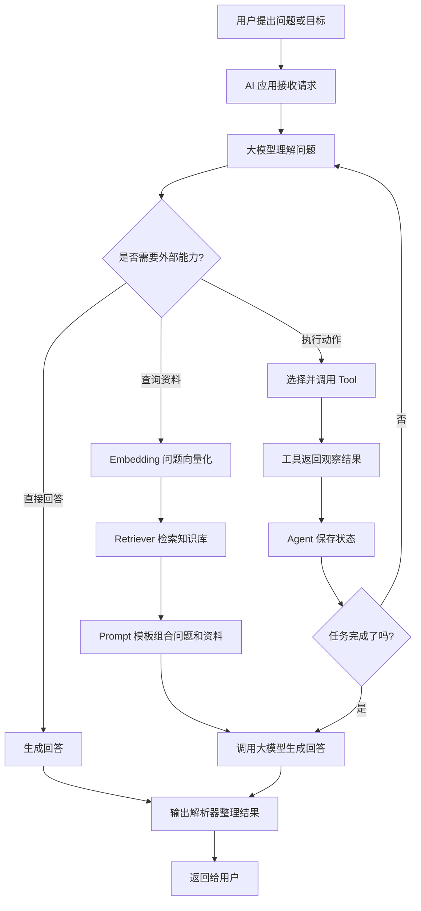

# LangChain 是什么？给大模型应用准备的“AI 组件库与流程编排工具”

## 摘要

LangChain 是面向大模型应用的 SDK 和流程编排框架。它通过组件化方式，把模型、Prompt、Embedding、RAG、工具和 Agent 连接起来。

在学习大模型应用时，人们经常同时遇到模型、RAG、Embedding、工具调用、Agent 和 LangChain。理解它们的层次关系，有助于从“会调用模型”进一步走向“会构建 AI 应用”。

## 一、LangChain 不是模型，也不是 Agent

首先，LangChain 不是一个大模型。

Qwen3、GPT、Claude 这类东西，才是大模型。它们负责理解语言、分析问题和生成回答。

LangChain 也不是一个 Agent。Agent 是一种应用运行方式：模型围绕一个目标进行判断、调用工具、获取结果，然后继续完成任务。

LangChain 更像是一个帮助我们搭建大模型应用的 SDK 和框架。

如果把大模型比作一个大脑，那么 LangChain 就像一套用于搭建智能应用的组件库和连接器。

## 二、用 Ant Design 来类比 LangChain

如果做前端开发，我们可以使用 Ant Design。Ant Design 提供了 Button、Table、Form、Modal 等现成组件。

我们不需要每次都从零开始画按钮、写表格样式、处理弹窗，而是把这些组件组合成一个完整页面：

```text
表单 + 表格 + 按钮 + 弹窗 = 一个业务页面
```

LangChain 也有类似的思想，只是它提供的不是视觉组件，而是大模型应用组件：

```text
模型调用
Prompt 模板
Embedding
RAG 检索
Tool 工具
Agent
状态管理
输出解析
```

我们可以把这些组件组合成一个 AI 应用：

```text
模型 + 知识库 + 工具 + 状态 + 执行流程 = 一个 Agent 应用
```

因此可以这样记：

```text
Ant Design 帮你快速搭 UI
LangChain 帮你快速搭大模型应用流程
```

## 三、LangChain 的 Chain 是什么？

LangChain 里的 Chain，不是“长任务”，而是“调用链”。

调用链就是把多个步骤按照顺序连接起来：

```text
输入问题
  ↓
调用 Embedding
  ↓
检索知识库
  ↓
组装 Prompt
  ↓
调用大模型
  ↓
解析输出
  ↓
返回结果
```

这就像一个固定的生产线：每个步骤有明确的输入和输出，前一个步骤的结果交给下一个步骤。

在我们的本地 LangChain Demo 中，这条链是：

```text
OllamaEmbeddings
  ↓
ChatPromptTemplate
  ↓
ChatOllama
  ↓
StrOutputParser
```

它的意思是：

- `OllamaEmbeddings`：把问题转换成向量并检索资料
- `ChatPromptTemplate`：把问题和资料组合成 Prompt
- `ChatOllama`：调用本地 Qwen3-14B
- `StrOutputParser`：把模型消息整理成普通文本

这是一条 RAG Chain，但它还不一定是 Agent。

## 四、RAG、工具调用和 Agent 的关系

可以把它们看成不同的能力：

```text
RAG = 外部知识能力
Tool = 外部行动能力
State = 过程记忆
Loop = 持续执行能力
Agent = 能动态决定下一步的整体应用
```

如果我们把 LangChain、模型和 RAG 组合起来：

```text
LangChain + Qwen3 + RAG
        ↓
RAG 应用
```

如果加入一个工具：

```text
LangChain + Qwen3 + Tool
        ↓
工具调用应用
```

如果再加入状态、循环和动态决策：

```text
LangChain + Qwen3 + Tool + State + Loop
        ↓
Agent 应用
```

## 五、完整流程图



## 六、谁负责什么？

为了避免混淆，可以这样分工：

### 大模型负责思考

大模型负责：

- 理解用户问题
- 分析上下文
- 生成文本
- 在 Agent 场景中判断下一步

### LangChain 负责连接组件

LangChain 负责提供和组织：

- 模型接口
- Prompt 模板
- Embedding 接口
- Retriever
- Tool 定义
- Agent 运行机制
- 输出解析器

### RAG 负责提供外部资料

RAG 负责从知识库中找到相关资料，并把资料交给模型参考。

### Tool 负责真正执行动作

Tool 可以是：

- 查询时间
- 计算数字
- 查订单
- 读取文件
- 调用数据库
- 发送邮件

### Agent 负责动态协调

Agent 负责让模型围绕目标持续行动：

```text
理解目标 → 判断下一步 → 调用能力 → 查看结果 → 继续行动
```

## 七、LangChain 和 Agent 的区别

两者最容易混淆的地方是：Agent 也需要规划，LangChain 也能组织流程。

区别在于：

```text
LangChain 是搭建系统的框架
Agent 是搭建出来的一种动态运行系统
```

固定 Chain 通常是开发者提前规定好流程：

```text
问题 → 检索 → Prompt → 模型 → 输出
```

Agent 的流程可以根据问题发生变化：

```text
问题
  ↓
模型判断
  ├─ 直接回答
  ├─ 查询知识库
  ├─ 调用计算工具
  ├─ 询问用户更多信息
  └─ 根据结果继续下一步
```

因此，LangChain 本身不是 Agent，但可以帮助我们搭建 Agent。

## 八、一个真实的客服例子

用户说：

```text
我的订单为什么还没有发货？
```

Agent 可能这样处理：

1. 模型判断这是一个订单问题。
2. Agent 发现缺少订单号。
3. 系统询问用户订单号。
4. 用户提供订单号。
5. 模型决定调用订单查询工具。
6. Agent 传入订单号并执行查询。
7. 工具返回订单状态。
8. Agent 把结果交还给模型。
9. 模型结合售后知识库生成最终回复。

这里的关系是：

```text
模型负责判断
Agent 负责协调
工具负责查询
RAG 负责提供售后政策
LangChain 负责把这些组件连接起来
```

## 九、LangChain 能帮我们做什么，不能帮我们做什么？

LangChain 可以帮我们省掉很多通用工作：

- 不必每次手写模型请求格式
- 不必重复设计消息结构
- 不必从零封装工具接口
- 不必重复实现 RAG 的连接过程
- 不必手写所有 Agent 循环
- 不必手动处理每个模型响应格式

但 LangChain 不会替我们决定业务逻辑：

- 什么情况下查订单
- 哪些资料可以被访问
- 什么情况下允许退款
- 哪些工具可以被调用
- 什么时候必须转人工
- 怎样判断结果是否可信

这些仍然需要产品和开发者设计。

## 十、最后的总结

如果用一句话总结：

```text
大模型负责理解和生成，
RAG 负责提供知识，
Tool 负责执行动作，
Agent 负责动态完成任务，
LangChain 负责把这些能力组织起来。
```

LangChain 不是 IDE，也不是另一个大模型，更不是神经网络群。

它更像是大模型应用时代的 SDK 和流程编排框架。就像 Ant Design 帮我们快速组合 UI 组件，LangChain 帮我们快速组合模型、Prompt、RAG、工具和 Agent。

当我们只需要固定流程时，可以使用 Chain：

```text
检索 → Prompt → 模型 → 输出
```

当我们需要模型动态判断下一步时，可以使用 Agent：

```text
理解目标 → 选择能力 → 执行动作 → 查看结果 → 继续完成任务
```

这就是 LangChain 在 LLM 应用开发中的位置。

## 总结

LangChain 是框架，Chain 是固定调用链，Agent 是动态执行系统，RAG 是外部知识能力，Tool 是外部行动能力。

基于 LangChain，可以先搭建固定的 RAG Chain，再逐步加入工具、状态和循环，把它升级成能够自主选择下一步的 Agent。
